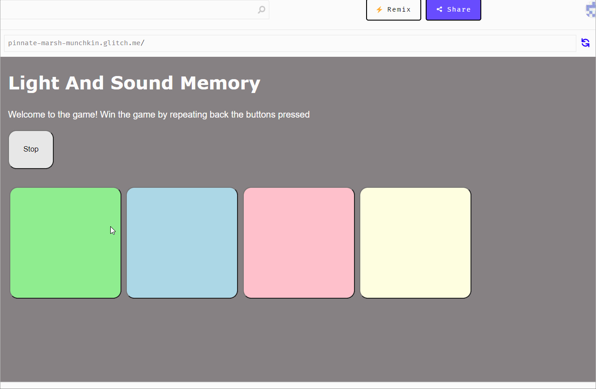
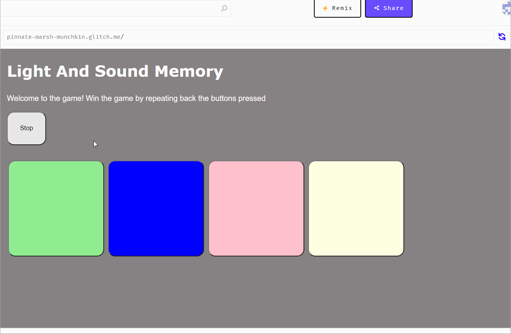

# Pre-work - *Memory Game*

**Memory Game** is a Light & Sound Memory game to apply for CodePath's SITE Program. 

Submitted by: **Sean Umali**

Time spent: **2** hours spent in total

Link to project: (https://glitch.com/edit/#!/pinnate-marsh-munchkin?path=index.html%3A1%3A0)

## Required Functionality

The following **required** functionality is complete:

* [x] Game interface has a heading (h1 tag), a line of body text (p tag), and four buttons that match the demo app
* [x] "Start" button toggles between "Start" and "Stop" when clicked. 
* [x] Game buttons each light up and play a sound when clicked. 
* [x] Computer plays back sequence of clues including sound and visual cue for each button
* [x] Play progresses to the next turn (the user gets the next step in the pattern) after a correct guess. 
* [x] User wins the game after guessing a complete pattern
* [x] User loses the game after an incorrect guess

The following **optional** features are implemented:

* [ ] Any HTML page elements (including game buttons) has been styled differently than in the tutorial
* [ ] Buttons use a pitch (frequency) other than the ones in the tutorial
* [ ] More than 4 functional game buttons
* [ ] Playback speeds up on each turn
* [ ] Computer picks a different pattern each time the game is played
* [ ] Player only loses after 3 mistakes (instead of on the first mistake)
* [ ] Game button appearance change goes beyond color (e.g. add an image)
* [ ] Game button sound is more complex than a single tone (e.g. an audio file, a chord, a sequence of multiple tones)
* [ ] User has a limited amount of time to enter their guess on each turn

The following **additional** features are implemented:

- [ ] List anything else that you can get done to improve the app!

## Video Walkthrough (GIF)

If you recorded multiple GIFs for all the implemented features, you can add them here:

## Reflection Questions
1. If you used any outside resources to help complete your submission (websites, books, people, etc) list them here. 
   https://www.quackit.com/css/css_color_codes.cfm

2. What was a challenge you encountered in creating this submission (be specific)? How did you overcome it? (recommended 200 - 400 words) 
A challenge I had in creating this submission was the lack of time to do it. I had only recently found out about this internship on March 31st through a friend and then noticed a pre-work due on April 1st; I was hoping it was an April fools joke, but it was not. I overcame this by basically just rushing the code and trying to get done as soon as possible. 

3. What questions about web development do you have after completing your submission? (recommended 100 - 300 words) 
I have always been quite interested in web development. After doing this submission I am curious about how to make a website that's created locally, like this simple memory game, become actually available in the online platform. Where someone can use a link to get to the actual website. I am also curious about how to make a website have multiple layers. Where you can click on a button on the website and it sends you to another page of that website, maybe showing the score for example in the simple memory game. Which brings me to another question; how does a website store data from different users. Is it stored in the cloud or maybe the website would have its own local files. My last question about web developing is, how do I start becoming a web developer. What  resources would I use to learn more and understand the basics in developing a website.

4. If you had a few more hours to work on this project, what would you spend them doing (for example: refactoring certain functions, adding additional features, etc). Be specific. (recommended 100 - 300 words) 
I only found out about this internship recently and did not have enough time to do the additional features. I would have first of all made the HTML page elements much more pleasing to the eyes. Then add 4 more functional buttons, leading to a total of 8. Then I would color the buttons from cold colors to hot colors, going from left to right. I would also edit the patterns and making the patterns change after each game using a random number generator. Afterwards I would add 4 buttons labeled; easy, normal, hard and hell. To correlate to 4 modes of the game. The difficulty would increase by making the patterns longer and making the clue hold times shorter, maybe even make there be 2 or 3 new clues instead of 1 per turn. To make the modes even more challenging I would first implement the feature “Give the player 3 strikes”, and then lower the number of viable strikes as the mode difficulty increases.

## Interview Recording URL Link

[My 5-minute Interview Recording](your-link-here)

## License

    Copyright [YOUR NAME]

    Licensed under the Apache License, Version 2.0 (the "License");
    you may not use this file except in compliance with the License.
    You may obtain a copy of the License at

        http://www.apache.org/licenses/LICENSE-2.0

    Unless required by applicable law or agreed to in writing, software
    distributed under the License is distributed on an "AS IS" BASIS,
    WITHOUT WARRANTIES OR CONDITIONS OF ANY KIND, either express or implied.
    See the License for the specific language governing permissions and
    limitations under the License.
